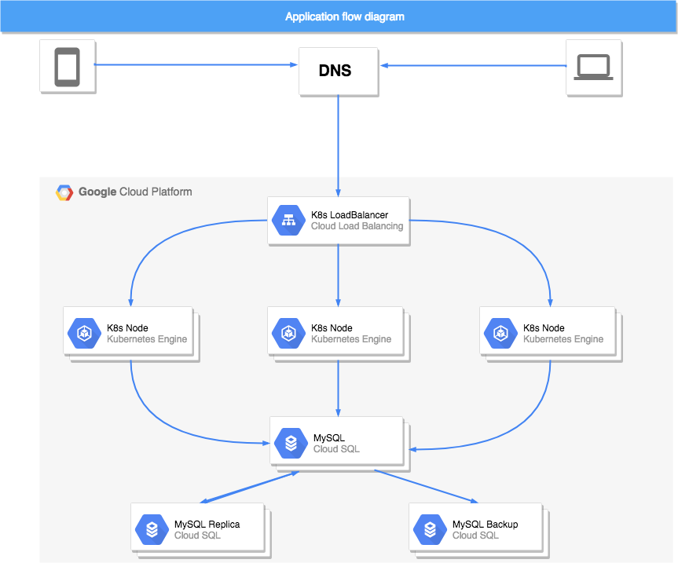
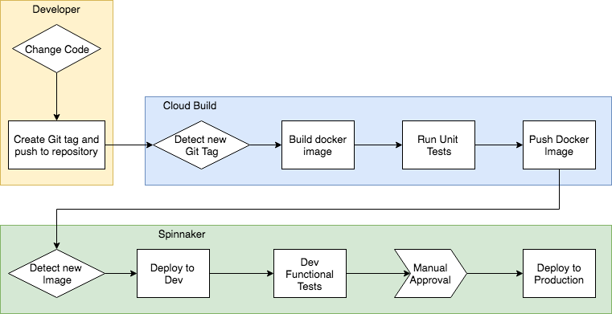
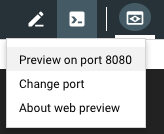
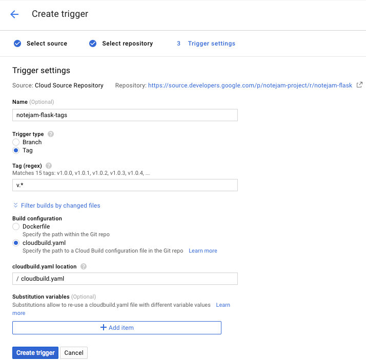
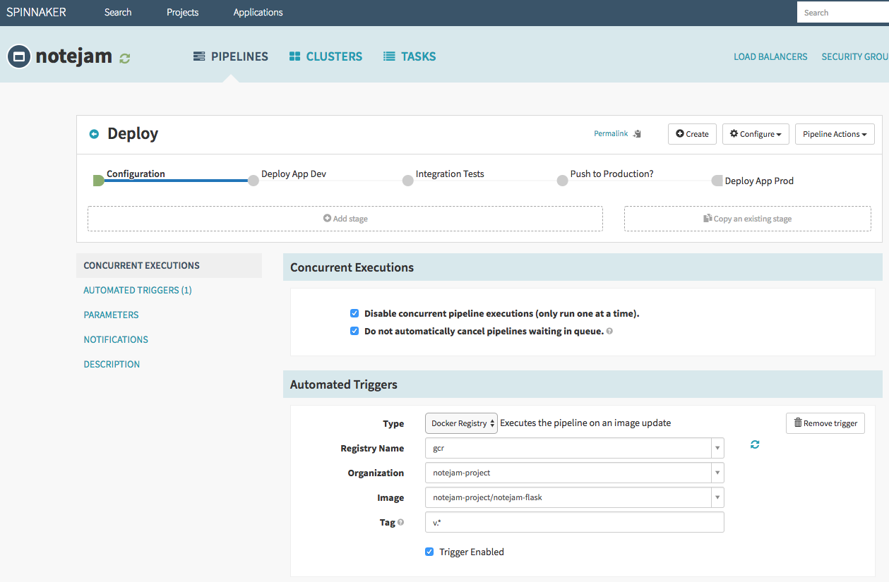

# **Continuous Delivery of Notejam Python-Flask application to Google Cloud Platform**

This README describes how to create a continuous delivery pipeline of [Notejam](https://github.com/komarserjio/notejam) 
app, specifically Python-Flask implementation, to Google Cloud Platform using **Google Kubernetes Engine**, 
**Cloud Source Repositories**, **Cloud Build**, **Resource Manager**, **Stackdriver**, and **Spinnaker**.

#### **Application Flow Diagram**



End-user will enter app's external domain name, eg. notejam.example.com, that should resolve to a Cloud Load Balancer's 
external IP. Load Balancer will then direct traffic to appropriate Kubernetes pod that has production application 
running on it, which in turn will talk to MySQL RDBMS database cluster if needed to retrieve persistent data required by
app.

MySQL database is running on Highly Available Cloud SQL instance with fail-over replica, which does both binary data 
logging for Point-in-Time Restore as well as automatic nightly backup.

All app logs from application pods, cloud builder and MySQL DB are easily available in Stackdriver for debugging, 
reporting, audit or other purposes.

#### **Pipeline Architecture**
****




To continuously deliver the Notejam Flask application the implemented flow is:
- software developers change application code in their feature branches;
- developers push, review and merge feature branches to master branch;
- developers or release manager create new app release by git tagging and pushing it to repository;
- Cloud Build detects new tag in the repository and starts building a test docker image;
- once docker image is built, it is started and app's unit tests are run;
- if unit tests pass, the docker image is published to GCP Docker Image Registry;
- Spinnaker detects new Docker image and starts the pipeline;
- pipeline first deploys new application version to a Staging environment;
- once new version is deployed to Staging a functional test of the application is performed;
- after functional tests pass QA there's a manual approval in Spinnaker by release manager to push new release to prod;
- after manual approval has been received, the application is deployed to production and becomes available to end-users.

To achieve all of the above, the following steps need to be performed:
- open [Google Cloud Console](https://console.cloud.google.com);
- create new project
- create new Google Kubernetes Engine cluster;
- configure users and identity for running Spinnaker in GKE;
- create MySQL cluster;
- configure users and identity for MySQL;
- create new git repo in Google Cloud Code Repositories and push your application there;
- create triggers to build new Docker image once the repository changes;
- configure Spinnaker to deploy new version of the application to GKE;


#### **Prerequisites**

Before you begin, make sure you have the followings created:

- Go to [Manage Resources](https://console.cloud.google.com/cloud-resource-manager) and create or choose an existing 
project;
- enable project [billing](https://cloud.google.com/billing/docs/how-to/modify-project);
- [Enable](https://console.cloud.google.com/flows/enableapi?apiid=sqladmin,container,cloudresourcemanager.googleapis.com,cloudbuild.googleapis.com
) Cloud SQL Admin, Kubernetes Engine, Cloud Resource Manager and Cloud Build APIs;

#### **Set up the environment**

Open [Google Cloud Shell](https://console.cloud.google.com/?cloudshell=true) or your local shell if you have Google
 Cloud, Kubernetes and Helm CLI tools installed.

Set the compute zone preference and the project name:
```
gcloud config set compute/zone europe-north1-a
gcloud config set project <project_id>
```

Create a Google Kubernetes Engine Cluster:
```
gcloud container clusters create flask \
    --machine-type=n1-standard-2 \
    --cluster-version 1.13.7-gke.24
```

#### **Configure identity and access management**

Create a service account that Spinnaker will use to store pipeline data to Cloud Storage, so it is persistent.

Create the service account:
```
gcloud iam service-accounts create  spinnaker-storage-account
```
Store the service account email address and your current project ID in environment variables for use in later commands:
```
export SA_EMAIL=$(gcloud iam service-accounts list \
    --filter="name:spinnaker-storage-account" \
    --format='value(email)')
export PROJECT=$(gcloud info --format='value(config.project)')
```

Bind the `storage.admin` role to the service account just created:
```
gcloud projects add-iam-policy-binding \
    $PROJECT --role roles/storage.admin --member serviceAccount:$SA_EMAIL
```

Generate and download the service account key. You need this key later when you install Spinnaker and upload the key to 
GKE.
```
gcloud iam service-accounts keys create spinnaker-sa.json --iam-account $SA_EMAIL
```

#### **Deploying Spinnaker using Helm**

Here you deploy Spinnaker using [Helm charts](https://helm.sh/)

Download and install helm:
```
wget https://storage.googleapis.com/kubernetes-helm/helm-v2.14.3-linux-amd64.tar.gz
tar zxfv helm-v2.14.3-linux-amd64.tar.gz
cp linux-amd64/helm .
```

Grant Tiller (the server side of Helm), the cluster-admin role in your cluster:
```
kubectl create clusterrolebinding user-admin-binding --clusterrole=cluster-admin --user=$(gcloud config get-value account)
kubectl create serviceaccount tiller --namespace kube-system
kubectl create clusterrolebinding tiller-admin-binding --clusterrole=cluster-admin --serviceaccount=kube-system:tiller
```

Grant Spinnaker the cluster-admin role so it can deploy resources across all namespaces:
```
kubectl create clusterrolebinding --clusterrole=cluster-admin --serviceaccount=default:default spinnaker-admin
```

Initialize Helm to install Tiller in your cluster:
```
./helm init --service-account=tiller
./helm update
```

Check that helm is installed properly by checking it's version and make sure that in the output you can see both client 
and server:
```
./helm version
```
```
Client: &version.Version{SemVer:"v2.14.3", GitCommit:"0e7f3b6637f7af8fcfddb3d2941fcc7cbebb0085", GitTreeState:"clean"}
Server: &version.Version{SemVer:"v2.14.3", GitCommit:"0e7f3b6637f7af8fcfddb3d2941fcc7cbebb0085", GitTreeState:"clean"}
```

#### **Configure Spinnaker**

Create a bucket for Spinnaker to store its pipeline configuration:
```
export PROJECT=$(gcloud info \
    --format='value(config.project)')
export BUCKET=$PROJECT-spinnaker-config
gsutil mb -c regional -l europe-north1 gs://$BUCKET
```

Create the configuration file:

```
export SA_JSON=$(cat spinnaker-sa.json)
export PROJECT=$(gcloud info --format='value(config.project)')
export BUCKET=$PROJECT-spinnaker-config
cat > spinnaker-config.yaml <<EOF
storageBucket: $BUCKET
gcs:
  enabled: true
  project: $PROJECT
  jsonKey: '$SA_JSON'

# Disable minio as the default
minio:
  enabled: false


# Configure your Docker registries here
accounts:
- name: gcr
  address: https://gcr.io
  username: _json_key
  password: '$SA_JSON'
  email: '$SA_EMAIL'
EOF
```

#### **Deploy Spinnaker Chart**
Use the Helm command-line interface to deploy the chart with your configuration set. This command typically takes five 
to ten minutes to complete.
```
./helm install -n cd stable/spinnaker -f spinnaker-config.yaml --timeout 600 \
    --version 0.3.1
```

After the command completes, run the following command to set up port forwarding to the Spinnaker UI from Cloud Shell:
```
export DECK_POD=$(kubectl get pods --namespace default -l "component=deck" \
    -o jsonpath="{.items[0].metadata.name}")
kubectl port-forward --namespace default $DECK_POD 8080:9000 >> /dev/null &
```

To open the Spinnaker user interface, click **Web Preview** in Cloud Shell and click **Preview on port 8080**:


You should see the welcome page from Spinnaker.

#### **Building the docker image**

Here you configure Cloud Build to detect changes to your application source code, build a Docker image, and then push 
it to Container Registry.

##### **Creating the Source code repository**

Download and extract app source code:
```
curl -LO https://github.com/borism/gcp-ci-cd-python-apps/archive/master.zip
unzip master.zip
cd gcp-ci-cd-python-apps/
```

Make the initial commit to your source code repository:

```
git init
git add .
git commit -m "initial commit"
```

Create new repository on Google Cloud Source to host app code:
```
gcloud source repos create notejam-flask
git config --global credential.https://source.developers.google.com.helper gcloud.sh
```

Add your newly created repository as remote:
```
export PROJECT=$(gcloud info --format='value(config.project)')
git remote add origin https://source.developers.google.com/p/$PROJECT/r/notejam-flask
```

Push the code to the new repository's master branch:
```
git push origin master
```

Check that you can see the code in the [code repository console](https://console.cloud.google.com/code/develop/browse/notejam-flask/master)

#### **Configure build triggers**

Here you will configure Cloud Build to build, test and push your Docker images every time you push a Git Tag to your source repository. Cloud Build will automatically check out your source code, build the Docker image, run the tests in it and if tests pass, push it to Container Registry.

To do that:
- go to [Build Triggers](https://console.cloud.google.com/gcr/triggers/add) page in Container Registry section.
- Select **Cloud Source Repository** and click **Continue**.
- Select your newly created `notejam-flask` repository from the list and click **Continue**.
- Set the following trigger settings:
  - **Name**: `notejam-flask-tags`
  - **Trigger type**: Tag
  - **Tag (regex)**: `v.*`
  - **Build configuration**: cloudbuild.yaml
  - **cloudbuild.yaml location**: /`cloudbuild.yaml`
- Click **Create trigger**



Now, once you push a new tag to your repository, prefixed with letter `v`, it will automatically build a docker image, 
test it and push it to Container Registry.

#### **Build image**

Now test a build image:
- go to your source code folder in Cloud Shell.
- create a git tag:
```
git tag v1.0.0
```
- push the tag:
```
git push --tags
```
- in **Container Registry**, click [Build History](https://console.cloud.google.com/gcr/builds) to check that the build 
has been triggered.

#### **Configure MySQL instance with Cloud SQL**

Our app uses a MySQL database. To connect to MySQL database, Google Cloud Platform provides [CloudSQL proxy](https://cloud.google.com/sql/docs/mysql/sql-proxy) 
sidecar container. To use it, you need to add that container to your registry, so your pipeline can fetch it. Run the 
following command in **Cloud Shell**:
```
export PROJECT=$(gcloud info --format='value(config.project)')
docker pull gcr.io/cloudsql-docker/gce-proxy:1.11
docker tag gcr.io/cloudsql-docker/gce-proxy:1.11 gcr.io/$PROJECT/gce-proxy:1.11
docker push gcr.io/$PROJECT/gce-proxy:1.11
```

First, set the details you will use, like mysql instance name, database name, database username and the password used.

```
export DB_INSTANCE_NAME="your_sql_instance_name_here"
export DB_NAME="your_database_name_here"
export DB_USER="your_database_user_here"
export DB_PASS="your_database_pass_here"
export DB_ROOT_PASS="your_database_root_pass_here"
```

Start a MySQL instance:
```
gcloud sql instances create $DB_INSTANCE_NAME \
--assign-ip \
--backup-start-time "03:00" \
--failover-replica-name "$DB_INSTANCE_NAME-failover" \
--enable-bin-log \
--database-version=MYSQL_5_7 \
--region=europe-north1 \
--project $PROJECT
```

In a couple of minutes you will have the MySQL instance set up with a failover replica and automatic daily backups. Set 
the root password:
```
gcloud sql users set-password root \
--host=% \
--instance=$DB_INSTANCE_NAME\
--password=$DB_ROOT_PASS \
--project $PROJECT
```

Now lets import our database schema (make sure you're in the folder with the app source code). First replace the values 
with the real ones:
```
sed "s/DB_USER/$DB_USER/g" schema.sql | sed "s/DB_PASS/$DB_PASS/g" | sed "s/DB_NAME/$DB_NAME/g" > schema-tmp.sql
```

Login to mysql console to import the schema, you will be prompted for `DB_ROOT_PASS` value:
```
gcloud sql connect $DB_INSTANCE_NAME -u root --project $PROJECT
Whitelisting your IP for incoming connection for 5 minutes...done.
Connecting to database with SQL user [root].Enter password:
```

After entering the password you should see the following output:
```
Welcome to the MariaDB monitor.  Commands end with ; or \g.
Your MySQL connection id is 11578
Server version: 5.7.14-google (Google)

Copyright (c) 2000, 2017, Oracle, MariaDB Corporation Ab and others.

Type 'help;' or '\h' for help. Type '\c' to clear the current input statement.

MySQL [(none)]>
```

Run the import command:
```
MySQL [(none)]> source schema-tmp.sql;
```

After import delete the temp schema with the passwords in it:
```
rm schema-tmp.sql
```

For Cloud SQL Proxy, we need the connection name of the MySQL Database, get it with the following command:
```
export CONNECTION_NAME=$(gcloud sql instances describe $DB_INSTANCE_NAME --format='value(connectionName)')
```

Set up MySQL service account, that will be used with CloudSQL Proxy in Kubernetes:

```
gcloud iam service-accounts create mysql-service-account \
--display-name "mysql service account" \
--project "$PROJECT"
```

Bind the `cloudsql.admin` role to the service account just created:

```
gcloud projects add-iam-policy-binding $PROJECT \
 --member serviceAccount:mysql-service-account@$PROJECT.iam.gserviceaccount.com \
 --role roles/cloudsql.admin \
 --project $PROJECT
```

Generate and download the service account key. You need this key later when you install CloudSQL Proxy in GKE.

```
gcloud iam service-accounts keys create ./mysql-key.json \
--iam-account mysql-service-account@$PROJECT.iam.gserviceaccount.com
```

Create the secret in Google Kubernetes Engine Cluster, that will be used in CloudSQL Proxy:

```
kubectl create secret generic cloudsql-instance-credentials \
--from-file=credentials.json=./mysql-key.json
```

Now Create the secrets that will be used in the application, the username and the password to connect to the database:

```
kubectl create secret generic cloudsql-db-credentials \
--from-literal=dbname=$DB_NAME \
--from-literal=username=$DB_USER \
--from-literal=password=$DB_PASS
```

#### **Configure Deployment Pipeline**

Now that you have your images automatically built, you have your Database set up with Failover replication and daily 
backups, it's time to tie them together in a pipeline.

First create the application from Spinnaker UI, click on **Actions**, then **Create Application**.

In the **New Application** dialog, enter the following fields:
- **Name**: `notejam`
- **Owner email**: [your email address]

Make sure the applicaiton name is `notejam`, because this is the name set in the spinnaker deployment file.

##### **Create service load balancers**

To avoid having to enter the information manually in the UI, use the Kubernetes command-line interface to create 
load-balancers for your services. Alternatively, you can perform this operation in the Spinnaker UI.

In Cloud Shell, run the following command from the source code directory:
```
kubectl apply -f k8s/
```

##### **Create the deployment pipeline**

Run the following command in cloud shell to upload the pipeline to Spinnaker instance:
```
export PROJECT=$(gcloud info --format='value(config.project)')
export CONNECTION_NAME=$(gcloud sql instances describe $DB_INSTANCE_NAME --format='value(connectionName)')
sed s/PROJECT/$PROJECT/g spinnaker/pipeline-deploy.json | sed s/CONNECTION_NAME/$CONNECTION_NAME/g | curl -d@- -X POST --header "Content-Type: application/json" --header "Accept: /" http://localhost:8080/gate/pipelines
```
If everything is fine, you should see your pipeline in Spinnaker UI. If you click Configure, it should look like this:



Now, if you push a new tag to your git repository, it will do the followings:
- Cloud Build will detect the new tag and trigger the build of the docker image;
- run tests in that docker image;
- push the image to docker registry;
- spinnaker will detect that new image and start the pipeline;
- it will deploy it to dev environment and test basic application functionality;
- once test passes it will wait for manual approval to deploy to prod.

Once it is deployed to prod, you should be able to see the app, get it's public IP address with the following command:
```
export PUBLIC_IP=$(kubectl get service notejam-prod -o jsonpath="{.status.loadBalancer.ingress[0].ip}")
echo $PUBLIC_IP
12.34.45.56
```

Enter that IP address in your browser and you should see the working app. Normally IP address would be associated 
with a DNS A record, i.e. notejam.example.com.

That's it. Once you change something in the app source code repository and push a new tag, it will automatically be 
deployed to staging, and with a manual approve, to production.
